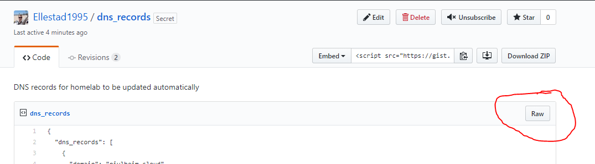
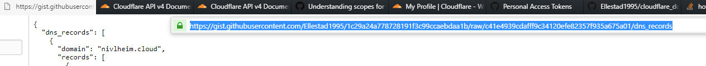

# Updating Cloudflare dns record when WAN has dynamic ip
Script is written in Python3 for updating dns records at Cloudflare using their api.

Uses a json file hosted on a private gist on github.

The script authenticates to github to retrieve the newest `dns_records` gist and updates the entries on Cloudflare.

# Setup 

1. Create gist with records and make api token
2. 

## 1. gist

### Create a private gist on Github to host the records file.

Name it whatever you want, e.g. `dns_records`. 

**Copy the url to the gist** and insert it into `update_dns.py`, into the `GHDNSRecordsGistUrl` variable.






Example records file:
```json
{
  "dns_records": [
    {
      "domain": "nivlheim.cloud",
      "records": [
        {
          "type": "A",
          "name": "bifrost.nivlheim.cloud",
          "content": "",
          "ttl": "1",
          "proxied": true
        },
        {
          "type": "A",
          "name": "plex.nivlheim.cloud",
          "content": "",
          "ttl": "1",
          "proxied": true
        }
      ]
    },
    {
      "domain": "joaprint.xyz",
      "records": [
        {
          "type": "A",
          "name": "www.joaprint.xyz",
          "content": "",
          "ttl": "1",
          "proxied": true
        },
        {
          "type": "A",
          "name": "plex.joaprint.xyz",
          "content": "",
          "ttl": "1",
          "proxied": true
        }
      ]
    }
  ]
}
```
 
### Create access token

 Create a access token from [https://github.com/settings/tokens/new](https://github.com/settings/tokens/new).
 
 Selected scopes: `gist`

**Copy the access token** and instert it into `update_dns.py` in the `GHPersonalAccessToken` variable.


## 2. Setup docker

```bash
docker run -d cloudflarednsupdater:latest \
--env  GHPERSONALACCESSTOKEN='' \
--env GHDNSRECORDSGISTURL='' \
--env CFAPITOKEN='' \
--name cloudflarednsupdater dockerhubid/imagename
```


## 2. Setup systemd or task scheduler

TODO:

`Systemd` or Windows Task Scheduler is used to run the docker container on a schedule. The task also updates the project files.

> The script can be run as ofte as you want. But every 6 hours should be sufficient.


```systemd
[Unit]
Description=Execute updata dns script
After=default.target docker_network_apps.service
Requires=default.target docker_network_apps.service

[Service]
Type=oneshot
User=root
ExecStartPre=/bin/bash -c "git pull <url>" 
ExecStartPre=/usr/bin/docker pull python:latest
ExecStartPre=/bin/bash -c "/usr/bin/docker rm -f  2>/dev/null"
ExecStart=/bin/bash -c "/usr/bin/docker run --name mystuffcontainer mystuff:stable mystuff"
```

```systemd
[Unit]
Description=My stuff runs at 00:10 sharp.

[Timer]
OnCalendar=00:10:00

[Install]
WantedBy=multi-user.target
```

3. Setup the docker project

